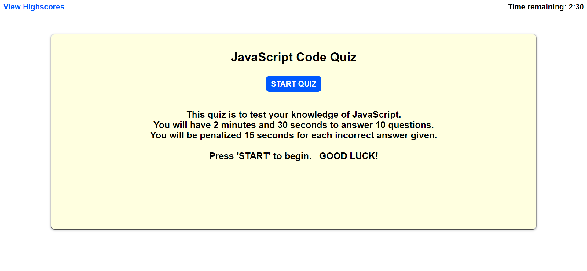

# JavaScript Code Quiz

## Description

This is the JavaScript Code Quiz web application. These files are for review for the Module 4 Challenge.

## Installation

N/A

## Usage

This web app has been created with the following functionality:

The user is presented with 10 questions to answer in 2 minutes and 30 seconds with 15 seconds subtracted for each question. Upon completing the quiz, the user can enter their initials and save their score to a highscore page. The questions are randomized and the code can easily be edited to change the number of questions, time limit, and penalty for wrong answers.

## Screenshot/Link

[JavaScript Code Quiz](https://cray412.github.io/JavaScript-Code-Quiz/)

## Credits

N/A

## License

Please refer to the LICENSE in the repo.